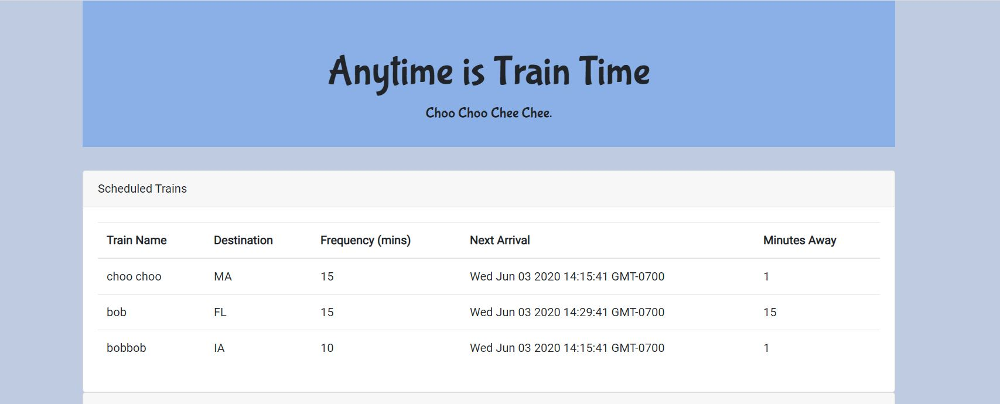
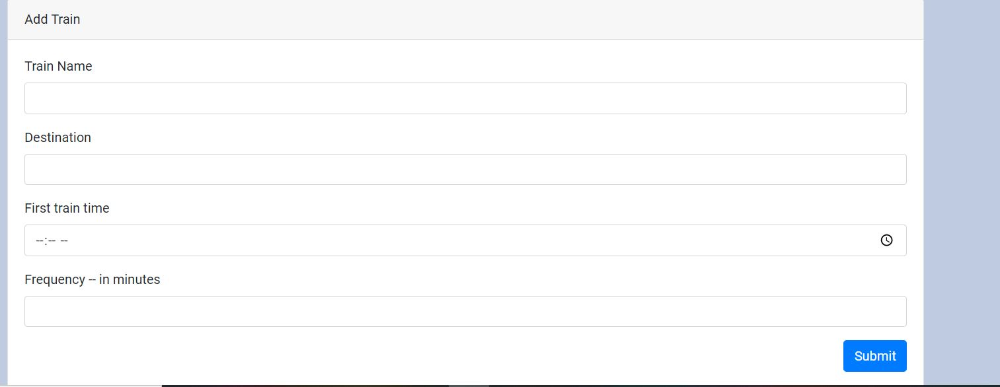
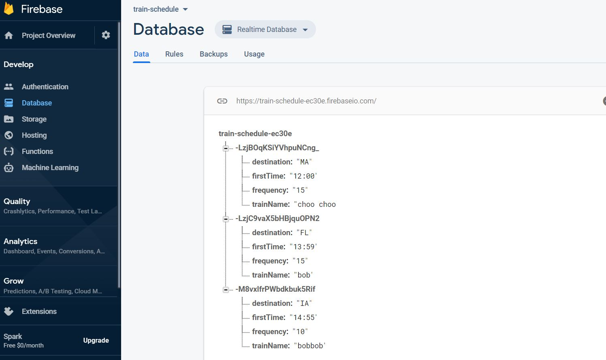

# Train-Schedule!

## Overview
This is a firebase application to accept input from user to create a fictional train list and calculate the next train and minutes away

## Getting Started
https://jyochsna.github.io/train-schedule

## App Images
#### Schedule Train 

#### Add Train Form

#### Firebase Data

## Technologies Used
* Google Font
* jQuery
* Firebase

Copyright &copy; 2020 | Jyochsna Gongal